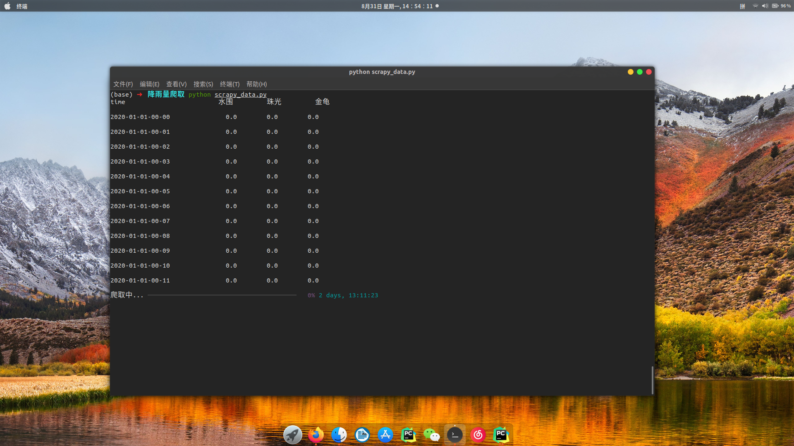

# 深圳市-自动化站数据爬取

## 使用方法：

**第一步：打开`config.json`文件，内容如下：**

```json
{
  "area": [
    "水围",
    "珠光",
    "金龟"
  ],
  "start_time": "2020-01-01-00-00",
  "end_time": "2020-08-30-00-00",
  "qType": "RainM30"
}
```

* 第一列为区域的选择，存放为`list`的形式，增删区域用 ` , ` 隔开。

* 第二个`start_time`为起始的爬取时间

* 第三个`end_time`为终止的时间

* 第四个`qType`为爬取的类型，如`RainM30`代表的是`30分钟滑动雨量`，所有可爬取类型的代号见附录


**第二步： 在终端执行 `scrapy.py`文件****

```bash
python scrapy_data.py
```

即可开始执行（首次执行会自动安装相应模块）




## 附录

可选的的爬取类型如下所示：

| 类型     | 分类       | 代号            |
| -------- | ---------- | --------------- |
| 气温     | 分钟       | TemperatureM    |
|          | 日最高     | TemperatureDmax |
|          | 日最低     | TemperatureDmin |
| 滑动雨量 | 30分       | RainM30         |
|          | 1时        | RainH01         |
|          | 3时        | RainH03         |
|          | (以此类推) | ...             |
| 日雨量   | 日雨量     | RainDayR24H     |
| 风速     | 瞬时       | WindMS          |
|          | 时最大瞬时 | WindHmaxS       |
|          | 日最大瞬时 | WindDmaxS       |
|          |            |                 |
| 湿度     | 分钟       | HumidityM       |
|          | 日最高     | HumidityDmax    |
|          | 日最低     | HumidityDmin    |
|          | 日平均     | HumidityDavg    |
| 气压     | 分钟       | PressureM       |
|          | 日最高     | PressureMDmax   |
|          | 日最低     | PressureMDmin   |
|          | 日平均     | PressureMDavg   |
| 能见度   | 能见度     | Visv            |
|          | 日最低     | VisDmin         |

